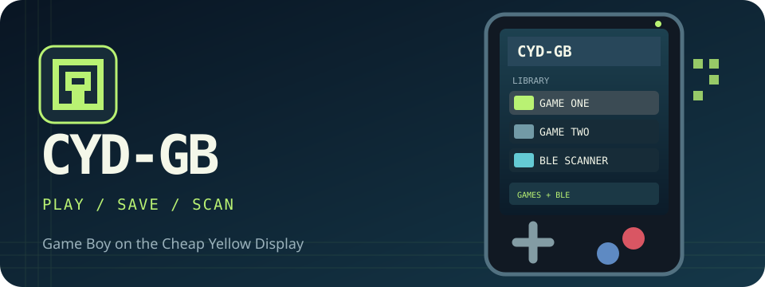

# CYD-GB 🎮

[English README](README.md)



*Görsel bir arayüz çizimidir; gerçek cihaz fotoğrafı değildir.*

CYD-GB, **ESP32-2432S028R Cheap Yellow Display** için Game Boy emülatörüdür. Oyunları FAT32 microSD karttan açar. Dokunmatik ekranla oynanır; PCF8574 üzerinden fiziksel tuşlar isteğe bağlıdır. PSRAM gerektirmez.

## Şu anda çalışan özellikler

- Dokunmatik yön tuşları, A/B, Start/Select ve duraklatma menüsü
- En fazla 64 ROM gösteren oyun kütüphanesi
- Kartuş RAM kayıtları (`.sav`) ve oyun oturumunu saklayan tek hızlı kayıt yuvası (`.state`)
- 20 renk paleti, kare atlama, parlaklık ve beş noktalı dokunmatik kalibrasyonu
- Açılış animasyonu, piksel temalı hub ve BLE beacon tarayıcı
- SPIFFS ROM önbelleği; erişilemezse SD kart üzerinden çalışma

Ses şu anda kapalıdır. Emülatör özgün Game Boy’u hedefler; yalnızca Game Boy Color için yapılmış oyunların çalışması garanti değildir. Pin ayarları ESP32-2432S028R içindir ve diğer CYD sürümlerinde farklı olabilir.

## Kurulum

Gerekenler: ESP32-2432S028R, FAT32 microSD kart ve [PlatformIO](https://platformio.org/install). Tuş kartı kullanacaksanız PCF8574 adresi `0x20`, SDA GPIO 16 ve SCL GPIO 17 olmalıdır.

```sh
git clone https://github.com/artanergin44-collab/cyd-gb.git
cd cyd-gb
pio run
pio run -t upload --upload-port PORT
pio device monitor -b 115200 --port PORT
```

`PORT` yerine bilgisayarınızdaki seri portu yazın. Peanut-GB çekirdeği depoda bulunur; ayrıca indirmeye gerek yoktur. Flash bölüm tablosu değişirse flash silme gerekebilir; ROM ve kayıtlar microSD karttadır.

```text
microSD/
├── roms/
│   ├── gb/       oyun.gb
│   └── gbc/      oyun.gbc (uyumluluk değişebilir)
└── saves/         cihaz oluşturur
```

Yalnızca kullanma hakkınız olan ROM dosyalarını ekleyin.

## Kullanım

| İşlem | Dokunmatik ekran | İsteğe bağlı tuşlar |
| --- | --- | --- |
| Oyun veya tarayıcı seç | Listede öğeye dokun | Yön tuşları ve A |
| Sayfa değiştir | Alt çubuğun soluna/sağına dokun | Sol / Sağ |
| Oyunu kontrol et | Ekranın altındaki sanal tuşlar | İlgili tuşlar |
| Duraklat | Sağ üstteki `II` | Start + Select |
| Kayıt / ayarlar / çıkış | Menü öğesine dokun | Yön tuşları ve A; B ile devam |
| Dokunmatiği kalibre et | Kütüphanedeki `CAL` | Aynı alan |

**Save RAM / Load RAM**, oyunun kartuş belleğini `/saves/<oyun>.sav` dosyasında tutar. **Quick Save / Quick Load**, emülatörün o andaki durumunu `/saves/<oyun>.state` dosyasında tutar. Hızlı kayıt aynı ROM ve durum dosyası biçimiyle uyumludur; yazılım güncellemesinden sonra açılmayabilir. Kalıcı oyun ilerlemesi için oyunun kendi kayıt özelliğini ve `.sav` dosyasını kullanın. Önceki dosyanın `.bak` yedeği tutulur.

## Sorun giderme

| Sorun | Kontrol |
| --- | --- |
| Dokunmatik çalışmıyor | Güncel yazılımı yükleyin, `CAL` ile kalibre edin, kartınızın pinlerini `include/hw_config.h` ile karşılaştırın. |
| I²C okuma hatası | Tuş kartı isteğe bağlıdır. Takılıysa adresi ve kabloları kontrol edin. |
| Ekran siyah veya renkler yanlış | Kart sürümünüzün ekran denetleyicisini ve `platformio.ini` ayarını kontrol edin. |
| ROM görünmüyor | FAT32 biçimini ve `/roms/gb` dizinini kontrol edin. |
| Kayıt yüklenmiyor | ROM’un kartuş RAM desteğini ve seri monitördeki boyut hatasını kontrol edin. |

## Yol haritası

Bunlar **planlanan** işlerdir; henüz mevcut özellik olarak sunulmuyor:

1. **Genel BLE gamepad desteği:** HID cihaz keşfi, eşleştirme, tuş eşleme, yeniden bağlanma ve mevcut BLE tarayıcıyla birlikte çalışma testleri. Belirli bir kontrolcü modeli için uyumluluk iddiası ancak cihazla denenince yapılacak.
2. **Gelişmiş save state:** Birden fazla kayıt yuvası, önizleme ve yazılım sürümleri arasında uyumluluk yönetimi.
3. **Daha zengin hub:** Son oyunlar, favoriler, arama ve microSD’den isteğe bağlı kapak görselleri.
4. **Donanım görselleri:** Desteklenen CYD sürümlerinde çekilmiş gerçek fotoğraflar ve doğrulanmış ekran görüntüleri.

Piksel [logo](assets/logo.svg) ve [afiş](assets/hero.svg) dosyaları `assets/` içindedir. Kod MIT lisanslıdır; ayrıntılar [LICENSE](LICENSE) dosyasında. Emülatör çekirdeği [Peanut-GB](https://github.com/deltabeard/Peanut-GB), ekran sürücüsü [TFT_eSPI](https://github.com/Bodmer/TFT_eSPI) kullanır.
